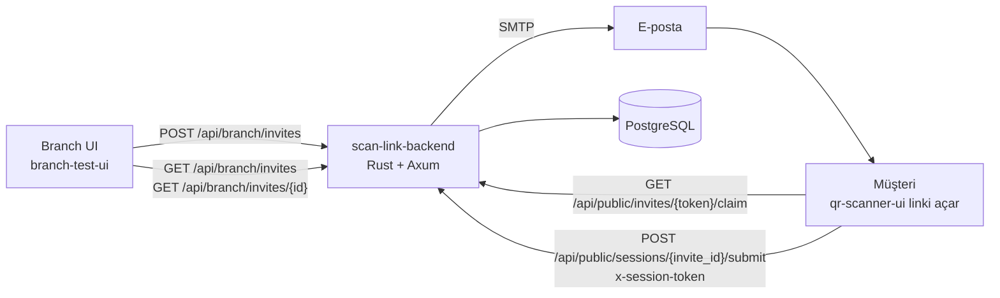

# Şekerbank Çek Tarama ve İstihbarat Sistemi

Bu doküman, sistemi sunumda uçtan uca anlatabilmeniz için hazırlanmıştır.
Kapsam: `branch-test-ui` + `qr-scanner-ui` + `scan-link-backend` + PostgreSQL + Nginx.

---

## 1) Sistem Ne İş Çözüyor?

Şube çalışanı müşteriye **tekil bir tarama bağlantısı** üretir. Müşteri bu bağlantıdan çekleri tarar ve gönderir. Şube tarafı aynı veriyi **anlık izler**, detay görür, çek görsellerini tekrar açar ve QR metadatasını inceler.

Amaç:
- Müşteri tarafında hızlı ve kontrollü çek toplama
- Şube tarafında merkezi izleme/inceleme (İstihbarat ekranı)
- Link ve gönderim tarafında güvenlik (tek gönderim, süre, token doğrulama)

---

## 2) Yüksek Seviye Mimari

---

## 3) Bileşenler ve Sorumluluklar

### A) `branch-test-ui` (Şube ekranı)

İki kritik sekme bu sistem için aktif:
- `CustomerInviteTab`: müşteri TC + e-posta girerek link üretir, mail tetikler, geçmişi listeler.
- `IntelligenceTab`: gönderilen oturumları filtreler, detay açar, çek görselini/QR verisini inceler.

Önemli davranışlar:
- Kayıtlar backend’den periyodik çekilir (`8sn` poll).
- Durumlar: `pending`, `claimed`, `submitted`, `expired`.
- Detayda çek görseli büyütme (fullscreen) ve QR içerik ayrıştırma var.

### B) `qr-scanner-ui` (Müşteri ekranı)

- Sadece `/capture/:inviteToken` rotasıyla akış başlatır.
- Link açılınca backend’den claim alır, `session_token` edinir.
- Çekleri tek tek ekler, özette seçer, silip tekrar çekebilir.
- Gönderimde çek + metadata backend’e gider.
- Başarılı submit sonrası otomatik teşekkür sayfasına yönlenir.

### C) `scan-link-backend` (Rust servis)

- Link üretimi, claim doğrulaması, submit finalizasyonu.
- SMTP ile davet maili gönderimi.
- PostgreSQL kalıcılığı.
- CORS + body limit + trace/log altyapısı.

### D) PostgreSQL

- `scan_invites`: link oturumu ve durum yaşam döngüsü.
- `scan_checks`: çek satırları (görsel + QR + metadata).

### E) Nginx (qr-scanner-ui önünde)

- TLS terminasyonu (`8443`)
- `/api` isteklerini backend’e reverse proxy
- `client_max_body_size 120m`
- Özel ağ erişim kısıtı (allow private network, deny all)

---

## 4) Neden Bu Teknolojiler?

| İhtiyaç | Seçim | Neden |
|---|---|---|
| Hızlı, tip güvenli backend | Rust + Axum + Tokio | Performans, güvenli concurrency, düşük runtime hata riski |
| Güvenli DB erişimi | SQLx + PostgreSQL | Derli toplu SQL, JSONB desteği, güçlü transaction modeli |
| Mail gönderimi | Lettre (SMTP) | Standart SMTP entegrasyonu, Gmail/app password senaryosuna uygun |
| İzlenebilirlik | tracing + OpenTelemetry | Her request’i trace_id ile takip edebilme |
| Şube UI | React + Vite + TypeScript + Tailwind | Hızlı geliştirme, okunabilir component yapısı |
| Müşteri tarama UI | React + zxing-wasm | Tarayıcı içinde QR okuma, native uygulama zorunluluğu olmadan |
| Ağ güvenliği / HTTPS | Nginx | SSL, proxy, payload limiti ve ağ bazlı erişim kontrolü |

---

## 5) Uçtan Uca İş Akışı

### 5.1 Link üretimi (Şube)
1. Şube çalışanı TC + e-posta girer.
2. `POST /api/branch/invites` çağrılır.
3. Backend:
   - token üretir,
   - token hash’ini DB’ye yazar,
   - `one_time_link` oluşturur,
   - SMTP varsa mail gönderir.

### 5.2 Link açma / claim (Müşteri)
1. Müşteri mail linkine tıklar: `/capture/{inviteToken}`
2. UI: `GET /api/public/invites/{inviteToken}/claim`
3. Backend:
   - token hash eşleşmesini kontrol eder,
   - süre dolmuşsa `expired` yapar ve reddeder,
   - daha önce submit edilmişse reddeder,
   - geçerliyse `session_token_hash` üretir/yazar, `status=claimed` yapar.

### 5.3 Tarama ve gönderim
1. Müşteri çekleri çeker, gerekirse silip tekrar çeker.
2. `POST /api/public/sessions/{invite_id}/submit` + `x-session-token`
3. Backend:
   - token hash doğrular,
   - payload doğrular,
   - eski çek satırlarını temizleyip yenilerini yazar,
   - `status=submitted`, `submitted_at` set eder,
   - `session_token_hash = NULL` yaparak oturumu kapatır.

### 5.4 Şube istihbarat izlemesi
- `GET /api/branch/invites` ile özet liste.
- `GET /api/branch/invites/{invite_id}` ile çeklerin görsel + QR + metadata detayları.

---

## 6) API Sözleşmesi (Özet)

### `GET /api/health`
- Amaç: servis ayakta mı?
- Dönüş: `{ status: "ok", now: "..." }`

### `POST /api/branch/invites`
- Amaç: müşteri için davet üretimi
- Girdi: `customer_national_id`, `customer_email`
- Dönüş: `invite_id`, `one_time_link`, `expires_at`, `email_dispatched`

### `GET /api/branch/invites`
- Amaç: şube özet listesi
- Dönüş: durum, müşteri bilgileri, çek sayısı, zaman damgaları

### `GET /api/branch/invites/{invite_id}`
- Amaç: istihbarat detayı
- Dönüş: invite özeti + `checks[]` (+ opsiyonel session metadata)

### `GET /api/public/invites/{invite_token}/claim`
- Amaç: link doğrulama + oturum açma
- Dönüş: `invite_id`, `session_token`, müşteri bilgileri, `expires_at`

### `POST /api/public/sessions/{invite_id}/submit`
- Amaç: çek ve metadata’yı finalize etmek
- Header: `x-session-token`
- Body: `checks[]`, `completed_at`, `session_metadata`
- Dönüş: `invite_id`, `submitted_at`, `check_count`

---

## 7) Veritabanı Tasarımı

## `scan_invites`
- Kimlik ve güvenlik:
  - `invite_id` (UUID PK)
  - `one_time_token_hash` (unique)
  - `session_token_hash` (nullable)
- Müşteri:
  - `customer_national_id`
  - `customer_email`
- Yaşam döngüsü:
  - `status` (`pending|claimed|submitted|expired`)
  - `claim_count`, `created_at`, `expires_at`, `claimed_at`, `submitted_at`
- Ek:
  - `batch_image_data_url` (opsiyonel)
  - `session_metadata` (JSONB)

## `scan_checks`
- `id` (BIGSERIAL PK)
- `invite_id` (FK -> `scan_invites`)
- `sequence_no`, `qr_value`, `image_data_url`, `captured_at`, `created_at`
- `metadata` (JSONB)
- `UNIQUE(invite_id, sequence_no)`

Not:
- Görseller şu an `image_data_url` alanında (base64 data URL) tutuluyor.
- Bu, geliştirme hızı için pratik; üretimde obje depolama (S3/MinIO vb.) değerlendirilebilir.

---

## 8) Tek Kullanım ve Güvenlik Modeli

## 8.1 Token güvenliği
- Dış dünyaya ham token gider.
- DB’de ham token tutulmaz, sadece `SHA-256 hash` tutulur.

## 8.2 Claim davranışı
- Link **süresi dolana kadar tekrar açılabilir**.
- Ancak link `submitted` olduktan sonra claim reddedilir.
- Claim’lerde `claim_count` artar, ilk claim zamanı korunur.

## 8.3 Tek gönderim garantisi
- Submit için `x-session-token` zorunlu.
- `session_token_hash` eşleşmesi zorunlu.
- Başarılı submit sonrası token hash silinir (`NULL`).
- Aynı invite’a ikinci submit -> `409 conflict`.

## 8.4 Süre kontrolü
- Claim ve submit aşamasında `expires_at` kontrol edilir.
- Süresi dolan kayıt `expired` olarak işaretlenir.

## 8.5 Erişim modeli
- `qr-scanner-ui` uygulama rotası sadece `/capture/:inviteToken` akışını hedefler.
- Catch-all ekranı kullanıcıyı bilgilendirip akışı kapatır.
- Nginx, özel ağ erişim kuralı ile dış erişimi sınırlar.

---

## 9) Performans ve Operasyon

- Backend body limiti: `120 MB`
- Nginx `client_max_body_size`: `120m`
- CORS allow-list ile origin kontrolü
- Şube UI poll periyodu: `8sn`
- Branch daemon sağlık kontrolü: `5sn` (UI overlay ile)

---

## 10) Gözlemlenebilirlik ve Hata Yönetimi

- Tüm backend hataları tek bir `AppError` tipinde toplanır.
- HTTP kodları net:
  - `400`: input/config
  - `401`: token/header yetkilendirme
  - `404`: bulunamadı
  - `409`: conflict
  - `410`: expired
  - `500`: internal/db
- `trace_id` log satırlarına yazılır (tracing + OpenTelemetry).

---

## 11) Sunumda Kullanabileceğiniz Kısa Konuşma Akışı

### Slayt 1: Problem ve hedef
- Müşteriden uzaktan çek toplama sürecini güvenli ve izlenebilir hale getiriyoruz.

### Slayt 2: Mimari
- Branch UI -> Backend -> DB, müşteri UI link ile aynı backend’e bağlanıyor.

### Slayt 3: Link güvenliği
- Token hash, süre kontrolü, tek submit kuralı.

### Slayt 4: Şube ekranı
- Link üretme + istihbarat listesi + detay ekranı (görsel/QR).

### Slayt 5: Müşteri ekranı
- Link doğrulama, çek çekme, silip tekrar çekme, gönderim.

### Slayt 6: DB ve kalıcılık
- `scan_invites` + `scan_checks`, durum yaşam döngüsü.

### Slayt 7: Operasyon
- Nginx TLS/proxy, payload limitleri, CORS, log/trace.

### Slayt 8: Yol haritası
- Görselleri obje storage’a taşıma
- Branch endpointlerine kurumsal auth katmanı
- “İstihbarata Gönder” aksiyonunu aktif iş akışına bağlama

---

## 12) Demo Senaryosu (Canlı Sunum)

1. Branch UI’de müşteri TC + e-posta gir, link üret.
2. Oluşan invite satırını listede göster (`pending`).
3. Müşteri linkini aç, claim sonrası durumu `claimed` olarak göster.
4. Müşteri 2 çek çekip gönderir.
5. Branch tarafında `submitted` durumuna düşüşü göster.
6. İstihbarat detayında:
   - çek görsellerini aç,
   - QR içeriğini ve ayrıştırılmış alanları göster.
7. Aynı linkle ikinci gönderimin engellendiğini (tek submit) anlat.

---

## 13) Önemli Notlar (Gerçek Durum)

- Bu sürümde çek görselleri DB’de tutuluyor (`image_data_url`).
- `IntelligenceTab` içindeki “İstihbarata Gönder” butonu şu an placeholder (aktif iş entegrasyonu yok).
- SMTP tanımlı değilse link üretimi devam eder, yalnızca mail gönderimi atlanır (`email_dispatched=false`).

---

## 14) Konfigürasyon Özeti

### Backend ortam değişkenleri
- `APP_ADDR`
- `DATABASE_URL`
- `INVITE_BASE_URL`
- `INVITE_TTL_MINUTES`
- `CORS_ALLOWED_ORIGINS`
- `SERVICE_NAME`
- SMTP: `SMTP_HOST`, `SMTP_PORT`, `SMTP_USERNAME`, `SMTP_PASSWORD`, `SMTP_FROM_ADDRESS`, `SMTP_FROM_NAME`, `SMTP_LOGO_URL`

### Frontend ortam değişkenleri
- `VITE_SCAN_LINK_API_ADDR` (her iki UI için backend base url)

---

Bu doküman teknik sunum, demo anlatımı ve soru-cevap için referans olarak kullanılabilir.
